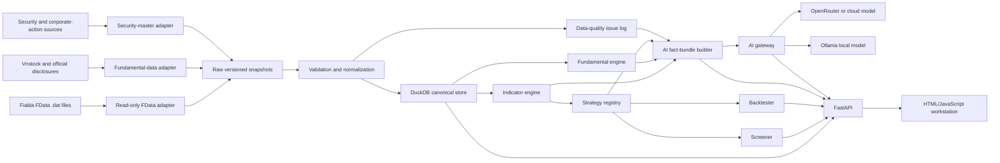

# VN Terminal Pro

## Multi-AI Development Plan for a Personal Vietnamese Stock Research Workstation

**Document version:** 1.1  
**Date:** 30 July 2026, amended the same day after direct inspection of `C:\FDATA\AmiBroker` and verification against the video transcript  
**Intended user:** One private investor/researcher  
**Primary market:** Vietnamese listed equities, HOSE, HNX, and UPCoM  
**Primary horizon:** Medium-term investing, approximately 1–6 months  
**Primary interface:** Local HTML/CSS/JavaScript application  
**Primary data source:** Fialda FData EOD files in `C:\FDATA\AmiBroker`  
**Recommended delivery model:** One lead AI integrator plus three parallel specialist AI workstreams  

---

## 1. Executive summary

The proposed product is a local, personal Vietnamese-equities research workstation inspired by the tool demonstrated between approximately [1:01:30](https://www.youtube.com/watch?v=JdgORe6n53M&t=3690s) and [1:05:40](https://www.youtube.com/watch?v=JdgORe6n53M&t=3940s) of the referenced video.

The workstation will combine:

- A TradingView-style candlestick and volume chart.
- Daily, weekly, and monthly analysis.
- Technical indicators and drawing overlays.
- A modular strategy library, 10–15 validated strategies in v1.0, expanding toward the approximately 52-strategy personal catalogue in v1.1.
- Full-market stock screening.
- Financial statements, ratios, growth, margins, and valuation panels.
- Deterministic Weinstein, Minervini, Wyckoff, momentum, trend, and liquidity calculations.
- Backtesting with transaction costs, slippage, liquidity constraints, and look-ahead protection.
- An AI analysis panel that explains verified calculations and produces conditional scenarios.
- Watchlists, saved layouts, signal history, and research notes.
- Data-quality and provenance warnings.

The recommended implementation is **not** a single giant HTML file. It should be a modular local web application:

1. HTML/CSS/JavaScript frontend.
2. Python FastAPI backend.
3. DuckDB and Parquet analytical storage.
4. A read-only FData adapter.
5. A deterministic quantitative engine.
6. A replaceable AI gateway supporting cloud and local models.

Using a lead AI integrator and three parallel specialist AI tools should produce:

- Clickable interface: days 1–2.
- Functional alpha: days 3–5.
- Feature-complete beta: days 6–8.
- Tested personal v1.0: approximately days 8–12.

These are agent working-day estimates. Calendar time will be longer because the user's review and approval bandwidth is the binding constraint; three to four calendar weeks is a realistic expectation.

The largest risks are not HTML development. They are:

- Defining strategies precisely. Eight AFL files exist; the rest of the catalogue requires new user-approved specifications, and that writing is the true critical path.
- Cleaning and classifying FData securities.
- Handling adjusted prices and corporate actions.
- Preventing look-ahead bias.
- Verifying AI interpretations.
- Coordinating independently generated modules without contract drift.

---

## 2. Understanding summary

The following understanding is treated as the approved product direction:

1. The product is a **full personal research workstation**, not a simplified stock-ranking page.
2. It is for one user on a Windows computer and is not initially a commercial service.
3. It focuses on Vietnamese equities and medium-term decisions rather than high-frequency trading.
4. The visible product should be an HTML-based workstation resembling familiar financial-chart applications.
5. Fialda FData EOD files will be the initial local price and volume source.
6. AI will help code the product and explain deterministic facts, but will not silently manufacture prices, indicators, or backtest results.
7. Work will be divided into isolated components that different AI tools can develop concurrently and later integrate through fixed contracts.

---

## 3. Assumptions

### 3.1 Product assumptions

- The product is for one local user.
- The application binds to `127.0.0.1` and is not exposed publicly.
- Windows 10 or later is available.
- The user can install Python, Node.js, and required local packages.
- No broker-order execution is included in v1.0.
- No commercial redistribution of Fialda data is included.
- EOD data is sufficient. The workstation is a post-session analysis tool used after the trading day.
- Intraday and realtime functions are a standing non-goal, not a deferral. The FData feed currently delivers EOD only; the `1m`, `5m`, `15m`, and `Tick` directories exist but are empty (verified 30 July 2026). Removing this boundary requires a deliberate future decision and a different data subscription.
- The application interface will be in Vietnamese or bilingual Vietnamese/English.

### 3.2 Data assumptions

- FData continues updating `C:\FDATA\AmiBroker\EOD`.
- FData writes the post-session update in the evening. On 30 July 2026 files were written between approximately 21:19 and 21:30 local time, so the daily pipeline should run at about 22:00.
- FData files are treated as read-only.
- OHLC prices appear to be historically adjusted and expressed in thousands of VND.
- Volume is expressed in shares.
- `Aux1` very likely holds the unadjusted daily average price (VWAP). Inspection on 30 July 2026 found that for FPT in December 2006 `Aux1` reads 420–463 (thousand VND) against an adjusted close of about 10–11, matching FPT's actual unadjusted trading range at listing, while on current bars `Aux1` sits near but not equal to the close (FPT 66.57 versus close 67.0). Confirming this against published VWAP for several tickers is a required WP1 task, because a confirmed `Aux1` yields per-day adjustment-factor estimates and lets the interface display support and resistance in real market prices. `Aux2` is a small integer of unknown meaning and remains unused.
- A separate security master is needed to distinguish equities, bonds, indices, derivatives, warrants, suspended securities, and delisted securities.
- Financial data must come from a different source, such as the existing Vnstock connector plus official company disclosures.
- Corporate-action and publication-date metadata must be preserved for valid historical testing.

### 3.3 Performance assumptions

The following are proposed v1.0 targets:

- Application startup: no more than 10 seconds on the target computer.
- Cached three-year daily chart: under 1 second.
- Initial uncached chart: under 3 seconds.
- Screening 1,500–1,800 securities with 10 strategies: under 30 seconds.
- Screening the full strategy library: under 2 minutes as a background job.
- Single-strategy market-wide backtest over 10–20 years: under 3 minutes.
- AI analysis: normally 5–30 seconds, depending on provider.

An inspection benchmark on 30 July 2026 parsed and validated the full repository (2,471 files, 3.63 million records, 144 MB) in seconds using plain Python. The targets above therefore carry a large margin, and DuckDB will handle the dataset trivially. Because analysis happens after the session via the daily close routine (WP16), batch jobs are not time-critical.

### 3.4 Reliability assumptions

- The previous validated data snapshot remains available if a refresh fails.
- A partial or invalid refresh never replaces the last good database.
- Every analytical output includes an `as_of_date`, data source, and freshness status.
- No trading recommendation is generated when required data is missing or fails validation.

### 3.5 Maintenance assumptions

- The user owns the project and its configuration.
- The lead AI tool maintains contracts, integration tests, and release notes.
- Strategy definitions are versioned.
- Data-provider adapters are replaceable.
- Dependencies are pinned and updated deliberately rather than automatically.

---

## 4. Explicit non-goals for v1.0

The following are excluded unless separately approved:

- Automatic broker order placement.
- Portfolio execution or rebalancing.
- High-frequency or tick-level trading.
- Intraday and realtime data of any kind. This is a standing product boundary (Section 3.1), not a deferral.
- Exchange-grade order-book reconstruction.
- Multi-user authentication.
- Cloud hosting.
- Mobile-native applications.
- Public distribution of Fialda data.
- A guarantee of investment performance.
- AI-generated prices, financial figures, or strategy definitions without source evidence.
- A pixel-for-pixel reproduction of TradingView, Bloomberg, or the presenter's application.

---

## 5. Lessons incorporated from the video

The implementation plan follows six important lessons from the presenter:

1. **Start with a familiar interface.**  
   The presenter used TradingView as a reference instead of designing every interaction from zero.

2. **The user's analytical insight is the product's core.**  
   AI can code a strategy only after its rules are defined.

3. **Strategies should be modular.**  
   The presenter's approximately 52 strategies appear as a selectable library rather than one opaque formula.

4. **AI should read local analytical context.**  
   AI receives chart, technical, financial, and liquidity data for the selected security.

5. **Use scenarios instead of unconditional forecasts.**  
   The demonstrated output contains conditions, support, resistance, risks, and invalidation.

6. **AI remains a second opinion.**  
   The presenter describes testing and comparing AI outputs with human chart reading.

7. **Money-flow reading is a signature AI use.**  
   At approximately [1:04:49](https://www.youtube.com/watch?v=JdgORe6n53M&t=3889s) the presenter emphasizes using AI on the full trading and liquidity data to judge whether large money has entered and whether accumulation ("lực gom") is visible. The plan therefore includes a deterministic money-flow module (Section 14) whose outputs enter the AI fact bundle.

8. **The presenter built on the same charting base this plan selects.**  
   At [1:01:42](https://www.youtube.com/watch?v=JdgORe6n53M&t=3702s) he states he used Claude to code against a TradingView L[ite]/Lightweight base, which directly validates the Lightweight Charts choice in Section 7.

---

## 6. Architecture alternatives

### Option A: One self-contained HTML file

**Description**

- One HTML file containing CSS, JavaScript, charts, calculations, and AI calls.
- Data loaded from manually selected CSV files.

**Advantages**

- Fastest demonstration.
- Easy to open.
- Similar to the local HTML file shown in the video.

**Disadvantages**

- API keys can leak into browser code.
- Large market-wide calculations can freeze the interface.
- Difficult for several AI tools to edit without conflicts.
- Weak testing and maintainability.
- Poor support for FData binary files and database persistence.

**Decision:** Reject for the complete workstation. It may be used only for an early visual mock-up.

### Option B: Modular local web application

**Description**

- HTML/CSS/JavaScript frontend.
- Python FastAPI backend.
- DuckDB/Parquet storage.
- Local browser interface at `http://127.0.0.1:<port>`.

**Advantages**

- Clear separation of data, calculation, UI, and AI.
- Safe backend storage of API keys.
- Suitable for parallel AI development.
- Testable and maintainable.
- Can be packaged later as a Windows desktop application.

**Disadvantages**

- Requires a local service.
- More initial project structure than one HTML file.

**Decision:** Recommended and selected.

### Option C: Desktop wrapper from the start

**Description**

- The modular local web application is immediately wrapped in Tauri or Electron.

**Advantages**

- Desktop-style installation.
- Better control over file access and startup.

**Disadvantages**

- Adds packaging and debugging complexity before core calculations are validated.
- Creates another integration surface for parallel agents.

**Decision:** Defer. Package the validated local web application after beta.

---

## 7. Recommended technology stack

| Layer | Recommended technology | Reason |
|---|---|---|
| Interface shell | HTML5 | Directly satisfies the requested HTML interface |
| Styling | CSS modules or scoped CSS | Low complexity and independent component ownership |
| Frontend logic | TypeScript or modern JavaScript ES modules | Modular, testable browser code |
| Charting | TradingView Lightweight Charts | Open-source Apache 2.0 financial charting library |
| Backend | Python FastAPI | Typed API contracts, validation, automatic OpenAPI documentation |
| Analytical storage | DuckDB | Local analytical SQL and efficient Parquet access |
| Raw snapshots | Parquet | Compact, versionable columnar files |
| Data processing | Python, pandas, NumPy | Suitable for FData parsing and quantitative calculations |
| API models | Pydantic | Shared validation and JSON schemas |
| Backend tests | pytest | Unit, integration, and numerical tests |
| Frontend tests | Vitest or equivalent | Component and utility testing |
| End-to-end tests | Playwright | Browser workflow and regression testing |
| Cloud AI gateway | OpenRouter-compatible backend adapter | Replaceable models through one server-side interface |
| Local AI | Ollama | Local model option without exposing data externally |
| Packaging | Windows launcher first; Tauri/Electron later | Avoid premature desktop-wrapper complexity |

Reference documentation:

- [TradingView Lightweight Charts](https://www.tradingview.com/lightweight-charts/)
- [Lightweight Charts documentation](https://tradingview.github.io/lightweight-charts/)
- [FastAPI documentation](https://fastapi.tiangolo.com/)
- [DuckDB documentation](https://duckdb.org/docs/stable/)
- [DuckDB Parquet queries](https://www.duckdb.org/docs/lts/guides/file_formats/query_parquet)
- [OpenRouter quickstart](https://openrouter.ai/docs/quickstart)
- [Ollama documentation](https://docs.ollama.com/index)
- [Playwright documentation](https://playwright.dev/docs/intro)

---

## 8. High-level system architecture



---

## 9. Proposed repository structure

```text
vn-terminal/
├─ README.md
├─ pyproject.toml
├─ package.json
├─ .env.example
├─ contracts/
│  ├─ openapi.yaml
│  ├─ schemas/
│  └─ fixtures/
├─ backend/
│  └─ app/
│     ├─ main.py
│     ├─ config/
│     ├─ data/
│     │  ├─ fdata/
│     │  ├─ fundamentals/
│     │  ├─ security_master/
│     │  ├─ quality/
│     │  └─ storage/
│     ├─ quant/
│     │  ├─ indicators/
│     │  ├─ strategies/
│     │  ├─ screener/
│     │  └─ backtest/
│     ├─ ai/
│     │  ├─ fact_bundle/
│     │  ├─ providers/
│     │  ├─ prompts/
│     │  └─ validation/
│     └─ api/
├─ frontend/
│  ├─ index.html
│  ├─ styles/
│  ├─ src/
│  │  ├─ app/
│  │  ├─ api/
│  │  ├─ chart/
│  │  ├─ indicators/
│  │  ├─ strategies/
│  │  ├─ screener/
│  │  ├─ fundamentals/
│  │  ├─ ai/
│  │  ├─ backtest/
│  │  ├─ watchlist/
│  │  └─ settings/
│  └─ tests/
├─ data/
│  ├─ raw/
│  ├─ snapshots/
│  ├─ canonical/
│  ├─ fixtures/
│  └─ quality_reports/
├─ tests/
│  ├─ backend/
│  ├─ quant/
│  ├─ contracts/
│  ├─ integration/
│  └─ e2e/
├─ scripts/
│  ├─ refresh_data.ps1
│  ├─ run_local.ps1
│  ├─ verify_release.ps1
│  └─ package_windows.ps1
└─ docs/
   ├─ architecture.md
   ├─ strategy_catalogue.md
   ├─ data_dictionary.md
   ├─ decision_log.md
   └─ user_guide.md
```

---

## 10. Canonical data contracts

Contracts must be fixed before parallel coding. Only the lead integrator changes them.

### 10.1 Price bar

```json
{
  "symbol": "FPT",
  "exchange": "HOSE",
  "security_type": "equity",
  "timeframe": "1D",
  "trading_date": "2026-07-30",
  "timezone": "Asia/Ho_Chi_Minh",
  "open": 65.2,
  "high": 67.2,
  "low": 64.8,
  "close": 67.0,
  "volume": 7571500,
  "adjustment_status": "adjusted_unknown_method",
  "source": "Fialda FData",
  "source_file": "C:\\FDATA\\AmiBroker\\EOD\\stock\\FPT.dat",
  "ingested_at": "2026-07-30T21:30:00+07:00",
  "quality_status": "valid"
}
```

### 10.2 Security master

Required fields:

- `symbol`
- `isin`, when available
- `exchange`
- `security_type`
- `company_name`
- `sector`
- `industry`
- `listing_date`
- `delisting_date`
- `trading_status`
- `currency`
- `price_unit`
- `lot_size`
- `source`
- `valid_from`
- `valid_to`

The 207 files under `EOD/index` are named with numeric codes (for example `0001.dat`, `0500.dat`) rather than symbols. The security master must include an index code-to-name mapping from an external source before relative-strength calculations against VN-Index or sector indices are enabled.

### 10.3 Financial observation

Required fields:

- `symbol`
- `period_end`
- `period_type`, quarter or year
- `statement_type`
- `metric_code`
- `metric_label_vi`
- `value`
- `currency`
- `unit`
- `consolidated`
- `restatement_version`
- `publication_date`
- `source_url`
- `ingested_at`

### 10.4 Strategy definition

Every strategy declares:

- `strategy_id`
- `version`
- `title_vi`
- `title_en`
- `category`
- `timeframe`
- `required_fields`
- `warmup_bars`
- `parameter_schema`
- `entry_rule`
- `exit_rule`
- `invalidation_rule`
- `liquidity_rule`
- `execution_convention`
- `evidence_fields`
- `reference`

### 10.5 Strategy evaluation result

```json
{
  "symbol": "FPT",
  "as_of_date": "2026-07-30",
  "strategy_id": "minervini_trend_template",
  "strategy_version": "1.0.0",
  "signal": "watch",
  "score": 6,
  "max_score": 8,
  "passed_criteria": [],
  "failed_criteria": [],
  "levels": {
    "support": [],
    "resistance": [],
    "invalidation": null
  },
  "data_version": "fdata-2026-07-30",
  "warnings": []
}
```

### 10.6 AI fact bundle

The fact bundle contains:

- Symbol identity and as-of date.
- Price and volume summary.
- Deterministic indicators.
- Money-flow and accumulation metrics from Section 14.
- Strategy results and failed criteria.
- Financial history and growth metrics.
- Support, resistance, and invalidation candidates.
- Data freshness and quality warnings.
- Source URLs and calculation definitions.

The language model must not access raw database tables directly.

---

## 11. API contract

The minimum FastAPI surface should include:

| Method | Endpoint | Purpose |
|---|---|---|
| GET | `/api/health` | Application, database, and provider status |
| POST | `/api/data/refresh` | Start atomic data refresh |
| GET | `/api/data/status` | Refresh progress and latest good snapshot |
| GET | `/api/symbols` | Search and filter the security universe |
| GET | `/api/bars/{symbol}` | Return validated OHLCV |
| GET | `/api/fundamentals/{symbol}` | Financial statements and derived metrics |
| GET | `/api/indicators/{symbol}` | Deterministic indicators |
| GET | `/api/strategies` | Strategy catalogue and versions |
| POST | `/api/strategies/evaluate` | Evaluate selected strategies |
| POST | `/api/screen` | Run market-wide screening |
| GET | `/api/screen/{run_id}` | Return background-screen results |
| POST | `/api/backtest` | Start a reproducible backtest |
| GET | `/api/backtest/{run_id}` | Return trades, metrics, and warnings |
| POST | `/api/ai/analyze` | Explain a server-created fact bundle |
| GET | `/api/watchlists` | Retrieve watchlists |
| PUT | `/api/watchlists/{id}` | Save a watchlist |
| GET | `/api/settings` | Retrieve local settings |
| PUT | `/api/settings` | Save local settings |

All endpoints must have:

- Typed request and response schemas.
- Explicit error responses.
- `as_of_date`.
- `data_version`.
- `source`.
- Quality and freshness warnings where applicable.

---

## 12. User-interface specification

### 12.1 Top toolbar

Controls:

- Symbol search.
- Exchange and security-type filters.
- Daily, weekly, and monthly timeframe.
- Date range.
- Data source.
- Last refresh time.
- Refresh button.
- Save layout.
- Model selection.
- Data-quality status.

### 12.2 Central chart

Functions:

- Candlesticks.
- Volume.
- Multiple panes.
- EMA and SMA overlays.
- Pivot, support, and resistance levels.
- Strategy entry, exit, and invalidation markers.
- Corporate-action markers.
- Crosshair.
- Zoom and pan.
- Screenshot/export.
- Indicator toggles.

TradingView Lightweight Charts is recommended because it is designed for interactive financial charts and is Apache 2.0 licensed. The application must retain required attribution.

### 12.3 Right analytical panel

Tabs:

1. **Indicators**
2. **Strategies**
3. **Screener**
4. **Fundamentals**
5. **AI analysis**
6. **Data quality**

### 12.4 Bottom workspace

Tabs:

- Watchlist.
- Current signals.
- Signal history.
- Backtest trades.
- Equity curve and drawdown.
- Portfolio notes.
- Data-refresh log.

### 12.5 AI panel

The panel displays:

- User question.
- Model and provider.
- Facts used.
- Base, bullish, and bearish scenarios.
- Conditions.
- Risks.
- Invalidation.
- Confidence.
- Sources.
- Quality warnings.

The panel must visually distinguish:

- **Fact**
- **Calculated result**
- **AI inference**
- **Unavailable/unverified information**

---

## 13. Strategy-engine plan

### 13.1 Strategy families

The strategy catalogue, 10–15 strategies in v1.0 growing to approximately 52 by v1.1, should be organized into families:

- Trend following.
- Moving-average alignment.
- Breakout.
- Momentum.
- Relative strength.
- Volume and liquidity.
- Mean reversion.
- Sideways/range trading.
- Weinstein stage analysis.
- Minervini templates.
- Wyckoff-derived rule sets.
- Pivot and support/resistance.
- Composite scorecards.

This list describes categories, not the final strategy catalogue. No undocumented rule should be invented merely to reach 52.

### 13.2 Development sequence

**Stage 1: Three reference strategies**

- One moving-average trend strategy.
- One breakout and volume strategy.
- One medium-term strategy based on an existing AFL file.

Purpose:

- Test the strategy interface.
- Validate signal timing.
- Establish golden datasets.
- Verify chart markers and backtests.

**Stage 2: Ten to fifteen core strategies**

- Add representative strategies from each major family.
- Complete the usable alpha.

**Stage 3, scheduled for v1.1 after the v1.0 release: the full personal catalogue of approximately 52 strategies**

- Translate the eight existing AFL files first.
- Add user-approved rule specifications incrementally. Specification writing is the user's work, not the agents' work, and is the true critical path.
- Version and validate each strategy independently.
- v1.0 ships with Stages 1 and 2 only, that is, 10–15 strategies.

### 13.3 AFL migration process

For every existing `.afl` file:

1. Preserve the original file.
2. Extract parameters and formulas.
3. Write a plain-language specification.
4. Identify AmiBroker-specific semantics.
5. Translate into pure Python.
6. Create fixed input/output fixtures.
7. Compare Python results with AmiBroker exploration or backtest exports.
8. Resolve differences before accepting the strategy.

---

## 14. Indicator engine

The indicator engine must be deterministic and independent from AI.

Initial indicators:

- SMA and EMA.
- RSI.
- MACD.
- ATR.
- Bollinger Bands.
- Rolling highs and lows.
- Rate of change.
- Relative strength versus VN-Index and sector.
- Volume moving averages.
- Volume-price trend measures.
- Money-flow and accumulation block, designed to answer the presenter's question at [1:04:49] of whether large money appears to be entering and whether accumulation is visible. Initial members are the accumulation/distribution line, on-balance volume, up-day versus down-day volume ratio, volume-at-price concentration, and unusual-volume flags. Once `Aux1` is confirmed as unadjusted VWAP, close-versus-VWAP positioning joins this block.
- Pivot levels.
- Rolling volatility.
- Drawdown.

Each indicator must document:

- Formula.
- Input price.
- Adjustment convention.
- Warm-up period.
- Missing-value behaviour.
- Comparison reference.
- Numerical tolerance.

Acceptance criterion:

- Results match an independent reference or AmiBroker export within a documented tolerance.

---

## 15. Screener

The screener must:

- Run across a defined security universe.
- Exclude non-equities by default.
- Exclude inactive and severely illiquid securities by default.
- Allow user-defined liquidity thresholds.
- Run one or many strategies.
- Show passed and failed criteria.
- Rank using deterministic scores.
- Store run date, strategy versions, parameters, and data version.
- Export results to CSV.

Default filters:

- Active equity.
- Last positive-volume date within a configurable range.
- Minimum 20-day median trading value.
- Minimum history length.
- No unresolved critical data-quality issue.

The screener must not treat a current file date as proof that a security remains actively traded.

---

## 16. Backtesting

The backtester should use daily bars initially.

Required controls:

- Entry at next open or next close, explicitly selected.
- Exit convention.
- Transaction cost.
- Slippage.
- Position size.
- Maximum concurrent positions.
- Liquidity constraint.
- Price-adjustment convention.
- Benchmark.
- In-sample and out-of-sample periods.

Required outputs:

- Trade list.
- Equity curve.
- Drawdown curve.
- CAGR or annualized return.
- Volatility.
- Sharpe and Sortino, with definitions.
- Maximum drawdown.
- Win rate.
- Profit factor.
- Average holding period.
- Turnover.
- Exposure.
- Benchmark comparison.
- Data and strategy versions.

Mandatory bias controls:

- No future bars.
- No use of later financial-publication information. When publication dates are unavailable, the affected fundamental inputs are excluded from backtests rather than assumed (Section 17).
- No survivorship-only universe.
- Corporate-action consistency.
- Explicit handling of suspended and zero-volume securities.
- Out-of-sample evaluation.

---

## 17. Financial-data module

The existing `vnstock_mcp.py` is a useful starting point because it retrieves:

- Symbols.
- Historical market data.
- Company profiles.
- Financial statements.
- Ratios.
- Company news.

It is not yet a production data pipeline.

The financial module must:

- Normalize quarterly and annual statements.
- Distinguish consolidated and separate statements.
- Identify cumulative versus standalone quarterly values.
- Preserve publication dates.
- Preserve restatements.
- Record currency and units.
- Calculate growth and margins deterministically.
- Link every displayed figure to a source.

Vietnamese free sources, including Vnstock, often lack reliable publication dates. The module therefore defines a degraded mode. Fundamentals without publication dates remain available for display and current screening but are excluded from historical backtests, with an explicit warning. Missing point-in-time metadata degrades functionality; it does not block WP9.

Initial panels:

- Revenue and profit history.
- Quarterly growth.
- Gross, operating, and net margins.
- ROE and ROA.
- Leverage.
- Cash flow.
- P/E and P/B, subject to available denominator quality.
- Financial quality warnings.

---

## 18. AI analysis architecture

### 18.1 AI role

AI may:

- Explain indicators.
- Compare strategy signals.
- Summarize financial trends.
- Interpret deterministic money-flow metrics and characterize possible accumulation, clearly labeled as inference.
- Construct conditional scenarios.
- Identify conflicting evidence.
- Generate research checklists.
- Translate technical output into Vietnamese.

AI may not:

- Create missing price data.
- Change indicator calculations.
- Invent source URLs.
- silently classify facts as verified.
- place orders.
- override data-quality blocks.

### 18.2 Provider abstraction

Create one server-side provider interface:

```text
analyze(fact_bundle, prompt_template, model_config) -> structured_response
```

Adapters:

- OpenRouter-compatible cloud adapter.
- Ollama local adapter.
- Optional direct OpenAI-compatible adapter.

API keys remain in backend environment variables and never enter browser code.

### 18.3 Structured AI response

Required fields:

- `summary`
- `facts`
- `base_case`
- `bull_case`
- `bear_case`
- `conditions`
- `risks`
- `invalidation`
- `conflicting_evidence`
- `confidence`
- `sources`
- `warnings`

### 18.4 AI validation

Before display:

- Reject responses that contain numbers not present in the fact bundle.
- Validate source IDs.
- Validate dates.
- Require a confidence level.
- Require an explicit warning when data is incomplete.
- Preserve the model name and prompt version.

---

## 19. Data-quality controls

### 19.1 Verified FData binary format (inspected 30 July 2026)

Every EOD file is an exact multiple of 40 bytes with this layout:

- A 40-byte header whose first uint32 (little-endian) is the record count.
- 40-byte records, each holding a uint32 date in YYYYMMDD form followed by nine float32 fields, in order an unused field, open, high, low, close, volume, an unused field, `Aux1`, and `Aux2`.
- OHLC values are back-adjusted and expressed in thousands of VND; volume is in shares.
- The latest FPT bar (30 July 2026, O 65.2, H 67.2, L 64.8, C 67.0, V 7,571,500) matches the fixture in Section 10.1.
- The `1m`, `5m`, `15m`, and `Tick` directories are empty and must be ignored, not treated as errors.

This specification must be written into `docs/data_dictionary.md` so the data agent codes against evidence.

### 19.2 Baseline issue inventory (full-repository scan, 30 July 2026)

The scan of all 2,471 EOD files (3.63 million records) found the following, each of which must become an automated test:

- 505 files containing OHLC violations (`low <= open, close <= high` breached).
- 34 files containing zero or negative prices.
- 11,020 zero-volume records, including carry-forward bars.
- 301 stock files ending in terminal zero-volume runs of five or more sessions, that is, suspended or delisted names.
- 2,315 of 2,471 files current to 30 July 2026; about 156 files stopped updating earlier.
- `EOD/cw/CSHB2604.dat` with a header count of 43 against 44 actual records and one out-of-order date. This file becomes a permanent malformed-file test fixture.
- Mixed security types in the stock directory.
- Historically adjusted prices with an undocumented adjustment method.
- Missing initial listing sessions for some securities.

Automated checks:

1. File size matches expected record layout.
2. Header count matches actual record count.
3. Date is valid.
4. Date is strictly increasing.
5. No duplicate date.
6. Prices are finite and positive.
7. `low <= open, close <= high`.
8. Volume is finite and non-negative.
9. Last positive-volume date is calculated.
10. Terminal zero-volume runs are flagged.
11. Security type is known.
12. Data freshness is within threshold.
13. Historical revisions are recorded.
14. Critical anomalies prevent strategy execution.

Severity levels:

- Critical.
- High.
- Medium.
- Low.

---

## 20. Security and privacy

Requirements:

- Bind to localhost only.
- Do not enable external network access by default.
- Store secrets in environment variables or Windows credential storage.
- Never commit `.env`.
- Never include API keys in prompts or logs.
- Redact personal paths in external AI requests when unnecessary.
- Send only bounded fact bundles to cloud AI.
- Offer a local-only Ollama mode.
- Keep raw FData files outside the repository.
- Do not modify files under `C:\FDATA\AmiBroker`.
- Use a read-only snapshot during refresh.
- Maintain an audit log of AI model, prompt version, data version, and timestamp.

Fialda's current terms state that automated data collection requires prior permission. Because FData already delivers these files to the user's computer under a paid personal subscription for use with AmiBroker, reading the same files locally and read-only is a materially weaker case of automated data collection than accessing Fialda services programmatically. The written-confirmation request remains the prudent course but does not need to block the pilot, which uses data already lawfully held locally:

- [Fialda terms of service](https://fialda.com/termsofservice)
- [FData product](https://betacorp.fialda.com/products/fdata)
- [Fialda Data API](https://betacorp.fialda.com/products/data-api)

---

## 21. Multi-AI work allocation

### 21.1 Core principle

Parallel AI tools may work concurrently only after contracts and fixtures are frozen.

No two tools should own the same files. Shared contracts are changed only by the lead integrator.

### 21.2 Recommended tool assignments

| Role | Recommended AI tool | Exclusive ownership | Main outputs |
|---|---|---|---|
| Lead architect and integrator | Codex with GPT-5.6 Sol | `contracts/**`, integration, releases | Architecture, schemas, API contracts, integration tests, release approval |
| Data/backend specialist | Codex GPT-5.6 Sol agent | `backend/app/data/**` | FData adapter, storage, quality checks, financial adapters |
| Quantitative specialist | Claude Code or a separate Codex agent | `backend/app/quant/**` | Indicators, strategy registry, screener, backtester |
| Frontend specialist | Claude Code or equivalent frontend-capable tool | `frontend/**` | HTML workstation, chart, panels, tables, interaction |
| Independent QA reviewer | Gemini CLI or another independent model | Read-only review plus assigned test paths | Adversarial tests, data reconciliation, contract and bias review |
| Runtime local analyst | Ollama-hosted model | No source-code ownership | Offline scenario generation and prompt evaluation |

Named tools are recommendations, not hard dependencies. If only Codex is available, use one lead Codex agent and three isolated Codex subagents with the same path ownership.

### 21.3 Why use different models

Benefits:

- Independent review reduces correlated mistakes.
- Frontend and quantitative modules can progress simultaneously.
- A reviewer can challenge assumptions without defending its own code.
- Local-model prompts can be tested without cloud expense.

Costs:

- More context must be supplied.
- Interface misunderstandings can create rework.
- Aggregate model usage increases.
- Integration remains sequential.

Expected effect:

- Calendar time reduction: approximately 40–55%.
- Aggregate compute increase: at least 15–35% under disciplined coordination.
- Larger increases are possible if agents duplicate work or contracts change frequently.

---

## 22. Detailed work packages

### WP0: Architecture and contracts

**Owner:** Lead integrator  
**Duration:** 0.5–1 day  
**Dependencies:** None

Deliverables:

- Repository scaffold.
- OpenAPI contract.
- Canonical schemas.
- Mock JSON fixtures.
- Dependency versions.
- Contribution and ownership rules.
- Acceptance checklist.

Acceptance criteria:

- Every workstream can develop against fixtures.
- No endpoint or schema is ambiguous.
- Contract tests run before implementation.

### WP1: FData binary adapter

**Owner:** Data/backend specialist  
**Duration:** 1–2 days  
**Dependencies:** WP0

Deliverables:

- Read-only parser for 40-byte EOD records.
- Header and record validation.
- Category discovery for stock, index, derivative, and warrant directories.
- Snapshot creation.
- Parquet output.
- Provenance metadata.

Acceptance criteria:

- Parses all valid FData files against the verified 40-byte layout in Section 19.1.
- Never modifies source files.
- Identifies malformed records, with `EOD/cw/CSHB2604.dat` as a required test fixture.
- Produces reproducible output hashes.
- Reconciles OHLCV for a rotating sample of 20–30 tickers against a scheduled AmiBroker export on every refresh; any mismatch blocks snapshot promotion, so a silent format change fails loudly.
- Tests the `Aux1` unadjusted-VWAP hypothesis against published VWAP for several tickers and documents the result in `docs/data_dictionary.md`.

### WP2: Security master and data quality

**Owner:** Data/backend specialist  
**Duration:** 1–2 days, overlapping WP1  
**Dependencies:** WP0

Deliverables:

- Security classification.
- Active/inactive status.
- Last positive-volume date.
- Quality issue table.
- Refresh report.
- Atomic snapshot promotion.

Acceptance criteria:

- Non-equities are excluded by default.
- Critical anomalies block affected calculations.
- Last file date is not treated as active status.
- Index numeric codes under `EOD/index` are mapped to names before relative-strength calculations are enabled.

### WP3: Storage and backend API

**Owner:** Data/backend specialist  
**Duration:** 1–2 days  
**Dependencies:** WP0, WP1

Deliverables:

- DuckDB schema.
- Parquet queries.
- FastAPI data endpoints.
- Settings and snapshot metadata.
- Health and refresh status endpoints.

Acceptance criteria:

- API matches OpenAPI contract.
- Cached chart request meets performance target.
- Failed refresh preserves previous snapshot.

### WP4: Chart workspace

**Owner:** Frontend specialist  
**Duration:** 1–2 days  
**Dependencies:** WP0 fixtures

Deliverables:

- `index.html`.
- Responsive workstation layout.
- Candlesticks and volume.
- Timeframe and symbol controls.
- Indicator overlays.
- Strategy markers.

Acceptance criteria:

- Works against mock API before backend completion.
- Displays at least 5,000 daily bars smoothly.
- Handles missing and loading states.

### WP5: Indicator engine

**Owner:** Quantitative specialist  
**Duration:** 1–2 days  
**Dependencies:** WP0 fixtures

Deliverables:

- Indicator registry.
- Initial indicators.
- Numerical documentation.
- Golden tests.

Acceptance criteria:

- No network or database access inside indicator functions.
- Pure functions produce repeatable results.
- Reference tolerances are documented.

### WP6: Strategy registry

**Owner:** Quantitative specialist  
**Duration:** 2–5 days in stages  
**Dependencies:** WP5

Deliverables:

- Strategy protocol.
- First three reference strategies.
- Ten to fifteen v1.0 strategies.
- Strategy catalogue with the approximately 52-strategy expansion scheduled for v1.1.

Acceptance criteria:

- Every strategy has version, parameters, rules, and tests.
- No strategy uses future values.
- Existing AFL translations match AmiBroker reference output.

### WP7: Screener

**Owner:** Quantitative specialist  
**Duration:** 1–2 days  
**Dependencies:** WP2, WP5, WP6

Deliverables:

- Universe filters.
- Strategy batch execution.
- Ranking.
- Background jobs.
- Export.

Acceptance criteria:

- Full run is reproducible.
- Results identify failed and passed conditions.
- Data version and strategy versions are retained.

### WP8: Backtester

**Owner:** Quantitative specialist  
**Duration:** 2–3 days  
**Dependencies:** WP5, WP6

Deliverables:

- Execution engine.
- Transaction costs and slippage.
- Position sizing.
- Metrics.
- Bias tests.

Acceptance criteria:

- No look-ahead.
- Results reproduce from saved configuration.
- Suspensions and liquidity constraints are handled explicitly.

### WP9: Financial module

**Owner:** Data/backend specialist  
**Duration:** 2–3 days  
**Dependencies:** WP0, WP3

Deliverables:

- Vnstock adapter improvement.
- Normalized statements.
- Growth and margin calculations.
- Source links.
- Financial endpoints.

Acceptance criteria:

- Consolidated/separate and quarter/year distinctions are visible.
- Publication dates are retained.
- Units and currencies are validated.

### WP10: AI fact bundle and gateway

**Owner:** Lead integrator  
**Duration:** 1–2 days  
**Dependencies:** WP3, WP5, WP6, WP9

Deliverables:

- Fact-bundle builder.
- Provider interface.
- OpenRouter adapter.
- Ollama adapter.
- Structured response validation.
- Prompt versions.

Acceptance criteria:

- API keys remain server-side.
- AI receives bounded facts only.
- Unsupported numbers are rejected or flagged.

### WP11: AI user interface

**Owner:** Frontend specialist  
**Duration:** 1 day  
**Dependencies:** WP4, WP10 contract

Deliverables:

- Chat input.
- Model selection.
- Scenario cards.
- Fact/inference distinction.
- Source links and warnings.

Acceptance criteria:

- User can inspect facts behind the response.
- Missing evidence is displayed clearly.

### WP12: Watchlists, layouts, and notes

**Owner:** Frontend specialist  
**Duration:** 1–2 days  
**Dependencies:** WP3, WP4

Deliverables:

- Watchlists.
- Saved chart templates.
- Saved strategy configurations.
- Research notes.
- Export/import settings.

Acceptance criteria:

- Settings survive restart.
- Corrupt settings fall back safely.

### WP13: Integration and contract testing

**Owner:** Lead integrator  
**Duration:** Continuous; 2–3 focused days  
**Dependencies:** All relevant packages

Deliverables:

- Generated or validated API client.
- Contract tests.
- End-to-end vertical slices.
- Error-handling matrix.
- Release checklist.

Acceptance criteria:

- Frontend and backend agree on every contract.
- No module reaches into another module's internal files.
- Application starts with one documented command.

### WP14: Independent QA and adversarial review

**Owner:** Independent QA AI tool  
**Duration:** 1–2 days  
**Dependencies:** Integrated beta

Deliverables:

- Data reconciliation.
- Strategy look-ahead review.
- Corporate-action review.
- Prompt hallucination tests.
- UI workflow tests.
- Risk report.

Acceptance criteria:

- Critical defects are closed.
- Remaining limitations are documented.

### WP15: Windows packaging and documentation

**Owner:** Lead integrator  
**Duration:** 1–2 days  
**Dependencies:** Accepted beta

Deliverables:

- PowerShell launcher.
- Dependency installation instructions.
- Optional packaged executable.
- User guide.
- Backup and restore guide.
- Upgrade procedure.

Acceptance criteria:

- Clean-machine installation test passes.
- Start, refresh, analyze, backtest, and stop workflows are documented.

### WP16: Daily close routine

**Owner:** Lead integrator  
**Duration:** 1 day  
**Dependencies:** WP3, WP7, WP10

Deliverables:

- A scheduled Windows task at approximately 22:00 on trading days, after FData completes its evening write (observed 21:19–21:30).
- Pipeline sequence of refresh, validation, full-library screening, fact-bundle pre-computation for watchlist names, and a short evening summary of new signals and data-quality flags.
- A validation gate that refuses to promote a snapshot whose latest date is not the most recent trading day.
- Optional batch pre-computation of AI analyses for watchlist names, capping daily cloud-model cost at a predictable amount.

Acceptance criteria:

- Opening the workstation in the evening shows current signals with no on-demand computation wait.
- A failed or stale refresh leaves the previous snapshot active and is clearly reported.

---

## 23. Parallel execution waves

### Wave 0: Contract freeze

**Duration:** 0.5–1 day

Lead integrator:

- Creates repository.
- Freezes schemas.
- Publishes fixtures.
- Assigns path ownership.

No parallel coding begins before this gate.

### Wave 1: Independent foundations

**Duration:** days 1–2

- Data AI: FData parser and canonical snapshot.
- Quant AI: indicator engine and three strategies.
- Frontend AI: complete workstation shell against mock JSON.
- Lead AI: contracts, integration harness, and AI response schema.

Milestone:

- One ticker can be displayed from a validated fixture.

### Wave 2: First vertical slice

**Duration:** days 3–5

- Connect real FData bars.
- Run three strategies.
- Display fundamentals for one ticker.
- Generate one bounded AI analysis.
- Save watchlist and settings.

Milestone:

- Functional alpha with 10–15 strategies.

### Wave 3: Feature expansion

**Duration:** days 6–8

- Expand the strategy catalogue to the approved 10–15 v1.0 set.
- Add full screener.
- Add backtester.
- Complete financial panels.
- Add data-quality interface.
- Add the daily close routine (WP16).

Milestone:

- Feature-complete beta.

### Wave 4: Reliability and release

**Duration:** days 8–12

- Independent QA.
- Numerical reconciliation.
- Performance tuning.
- Security review.
- Documentation.
- Windows packaging.

Milestone:

- Reliable personal v1.0.

---

## 24. Integration protocol

### 24.1 Ownership rules

- Lead owns `contracts/**`.
- Data AI owns `backend/app/data/**`.
- Quant AI owns `backend/app/quant/**`.
- Frontend AI owns `frontend/**`.
- Lead owns `backend/app/ai/**`, integration tests, and release files.
- QA AI is read-only except for assigned test and report paths.

### 24.2 Contract-change process

1. Specialist identifies a contract gap.
2. Specialist submits a short change proposal.
3. Lead assesses downstream effects.
4. Lead changes the contract and fixtures.
5. All specialists update against the same contract version.

### 24.3 Handoff checklist

Every component handoff includes:

- Files changed.
- Contract version.
- Commands to test.
- Test output.
- Known limitations.
- Data fixtures used.
- Security implications.
- Follow-up issues.

### 24.4 Integration order

1. Contracts and fixtures.
2. Data adapter and chart using real bars.
3. Indicator engine.
4. Strategy result display.
5. Screener.
6. Fundamentals.
7. AI fact bundle and analysis.
8. Backtesting.
9. Daily close routine.
10. Settings and packaging.

---

## 25. Testing strategy

### 25.1 Data tests

- Parse every FData file.
- Validate header and length.
- Validate dates and ordering.
- Validate OHLC and volume.
- Detect inactive symbols.
- Compare selected latest bars with a second source.
- Reconcile a rotating ticker sample against an AmiBroker export on every refresh.
- Parse `EOD/cw/CSHB2604.dat` as a permanent malformed-file fixture.
- Verify snapshot reproducibility.

### 25.2 Numerical tests

- Golden fixtures for every indicator.
- Cross-check selected indicators with AmiBroker.
- Property tests for range and monotonicity constraints.
- Corporate-action cases.
- Missing-bar and suspension cases.

### 25.3 Strategy tests

- Positive example.
- Negative example.
- Boundary conditions.
- Warm-up-period behaviour.
- Next-bar execution.
- No-look-ahead test.
- Version and parameter reproducibility.

### 25.4 Backtest tests

- Transaction costs.
- Slippage.
- Liquidity limit.
- Suspended security.
- Delisted security.
- Multiple positions.
- Benchmark alignment.
- Out-of-sample split.

### 25.5 AI tests

- No unsupported numbers.
- No missing source references.
- Conflicting evidence surfaced.
- Low-confidence response when data is incomplete.
- Provider failure and timeout.
- Local-model and cloud-model schema compatibility.

### 25.6 User-interface tests

Playwright workflows:

- Launch application.
- Search for a ticker.
- Change timeframe.
- Add indicator.
- Evaluate strategy.
- Run screener.
- Open financial panel.
- Request AI analysis.
- Run backtest.
- Save and restore layout.
- Display data-quality warning.

---

## 26. Definition of done

Version 1.0 is complete only when:

1. The application launches locally with a documented command.
2. FData EOD refresh works without modifying source files.
3. Invalid data cannot silently enter calculations.
4. Security types and inactive symbols are classified.
5. Daily, weekly, and monthly charts work.
6. Indicators match validated references.
7. The approved v1.0 catalogue of 10–15 strategies is versioned and tested.
8. Screening is reproducible.
9. Backtesting prevents look-ahead bias.
10. Financial metrics retain sources and publication dates.
11. AI receives deterministic fact bundles only.
12. AI outputs distinguish fact from inference.
13. API keys remain outside browser code and logs.
14. Saved settings survive restart.
15. End-to-end tests pass on the target Windows computer.
16. Known limitations and data licenses are documented.

---

## 27. Estimated time and cost

### 27.1 Development time

| Milestone | Four-AI estimate |
|---|---:|
| Visual workstation | 1–2 working days |
| Functional alpha | 3–5 working days |
| Feature-complete beta | 6–8 working days |
| Tested personal v1.0 | 8–12 working days |

These estimates assume:

- EOD scope.
- No broker execution.
- Stable FData format, now verified and reconciled against AmiBroker on every refresh.
- Clear strategy definitions for the 10–15 v1.0 set.
- Prompt access to all required AI tools.

Estimates are agent working days. Expect three to four calendar weeks elapsed, because the user's review and approval bandwidth, especially for strategy specifications, is the binding constraint.

### 27.2 Model usage

- Multi-AI development should reduce calendar time by approximately 40–55%.
- Disciplined parallel development may consume at least 15–35% more aggregate AI compute.
- Poor coordination may increase compute substantially through duplicated work and integration repair.
- Dollar cost cannot be estimated responsibly until subscription quotas or API token rates are specified.

### 27.3 Data and runtime costs

Fialda currently lists FData as a paid personal product with EOD and intraday access. Current pricing must be rechecked before purchase:

- [Fialda pricing](https://betacorp.fialda.com/pricing)

Other possible recurring costs:

- Cloud AI API usage.
- Optional Fialda Data API if local FData reuse is not authorized.
- No cloud-hosting cost for the recommended local deployment.
- Local Ollama inference has no per-request API fee but uses the user's hardware and electricity.

---

## 28. Risk register

| Risk | Impact | Probability | Mitigation |
|---|---|---:|---|
| FData local extraction not permitted | High | Medium | Obtain written permission or use approved API/export |
| FData binary format changes | High | Medium | Version parser, retain fixtures, and reconcile every refresh against an AmiBroker export so changes fail loudly |
| Adjusted historical prices change | High | High | Version snapshots and record adjustment status |
| Mixed securities contaminate screener | High | High | Maintain security master and default equity filter |
| Bad OHLC bars create false signals | High | Medium | Automated validation and critical blocks |
| Strategy rules are ambiguous | High | High | Require approved plain-language specification |
| Look-ahead bias | Critical | Medium | Point-in-time tests and next-bar execution |
| Survivorship bias | High | Medium | Retain inactive and delisted universe history |
| AI hallucinates evidence | High | Medium | Structured fact bundle and response validator |
| Agents edit shared files | High | Medium | Exclusive path ownership |
| Contract drift | High | Medium | Lead-only contract changes |
| One large HTML file becomes unmaintainable | High | High | Modular frontend and backend |
| Scope expands to realtime too early | Medium | High | Complete EOD v1.0 first |
| Windows packaging problems | Medium | Medium | Package only after beta and test clean install |

---

## 29. Decision log

| Decision | Alternatives considered | Reason |
|---|---|---|
| Build a modular local web application | One HTML file; immediate desktop wrapper | Best balance of maintainability, security, and parallel development |
| Use FData EOD first | Realtime first; Vnstock only | Matches medium-term horizon and existing local data |
| Treat FData as read-only | Modify or normalize source files in place | Protects vendor-managed data and recovery |
| Use DuckDB/Parquet | Browser-only arrays; large CSV files; server database | Appropriate for local analytical workloads |
| Use FastAPI | Browser direct file access; Node-only backend | Reuses Python quantitative ecosystem and typed contracts |
| Use Lightweight Charts | Custom canvas; proprietary advanced chart library | Open-source financial charting with manageable integration; the presenter's own tool is built on the same TradingView base [1:01:42] |
| Keep calculations deterministic | Let AI calculate indicators | Reproducibility and auditability |
| Use AI provider adapters | Depend on one AI model | Models and costs can change |
| Build 3, then 10–15, then approximately 52 strategies | Build all strategies simultaneously | Reduces systemic design errors |
| Lead AI owns contracts | Every specialist changes schemas | Prevents integration drift |
| Defer broker execution | Include orders in v1.0 | Reduces financial and security risk |
| Exclude intraday as a standing non-goal | Enable all FData intervals immediately | Post-session analysis is the stated use, and the current FData feed delivers EOD only (intraday directories verified empty) |
| Rescope v1.0 to 10–15 strategies | Ship approximately 52 in v1.0 | Only eight AFL specifications exist; user specification writing is the bottleneck |
| Add AmiBroker reconciliation loop | Trust the binary parser alone | AmiBroker is the format's intended consumer, so mismatches surface loudly instead of silently |
| Add daily close routine (WP16) | Compute on demand at first use | Matches the post-session use pattern, removes waiting, and caps daily AI cost |
| Treat `Aux1` as candidate unadjusted VWAP pending verification | Ignore Aux fields entirely | Inspection evidence indicates unadjusted average price, which would solve adjusted-versus-quoted price reconciliation |

---

## 30. Open questions requiring confirmation before implementation

1. What is the approved v1.0 list of 10–15 strategies, and in what order will the remaining catalogue be specified for v1.1?
2. Which existing AFL strategies should be migrated first?
3. Should the interface be Vietnamese-only or bilingual?
4. Should cloud AI be enabled by default, or should Ollama be the default?
5. Which OpenRouter or other model budget is acceptable?
6. Does Fialda authorize automatic local reading of FData files for personal analysis?
7. Is a browser-based local application sufficient, or is a packaged desktop executable required for v1.0?
8. Which official or commercial source will supply corporate actions and point-in-time security status?
9. Which financial metrics are mandatory for the first usable release?
10. Should portfolio tracking be included in v1.0 or deferred to v1.1?
11. Which source will supply the index code-to-name mapping for the 207 numeric-named files under `EOD/index`?
12. Which published VWAP source will be used to confirm the `Aux1` hypothesis?
13. What time does FData reliably finish its evening write, so the 22:00 schedule for the daily close routine can be confirmed or adjusted?

---

## 31. Immediate next steps

### Step 1: Product confirmation

Approve or revise:

- Assumptions.
- Non-goals.
- Interface language.
- EOD-first scope.
- Packaging target.

### Step 2: Data authorization

- Ask Fialda about local automated read-only use. This request runs in parallel and does not block the pilot, which uses data already delivered locally under the existing subscription.
- Identify permitted backup and snapshot behaviour.

### Step 3: Strategy inventory

- Catalogue the eight existing AFL files.
- Select three reference strategies.
- Write deterministic strategy specifications.

### Step 4: Contract package

- Create repository.
- Create schemas and fixtures.
- Freeze OpenAPI v0.1.
- Assign exclusive component ownership.

### Step 5: Two-day pilot

Pilot scope:

- FPT and KDH.
- One FData snapshot.
- One chart.
- Three indicators.
- Two strategies.
- One financial panel.
- One AI scenario response.

Pilot exit criteria:

- All components integrate through contracts.
- Latest bars match reference evidence.
- AI introduces no unsupported numbers.
- Actual elapsed time and model usage are recorded.

### Step 6: Scale to alpha and beta

- Expand to full market.
- Add 10–15 strategies.
- Add screener and backtest.
- Expand to the approved strategy catalogue.

---

## 32. Sources

### Video and product inspiration

- [Presenter's tool explanation, approximately 1:01:30](https://www.youtube.com/watch?v=JdgORe6n53M&t=3690s)
- [Presenter's local AI and strategy discussion, approximately 1:02:35](https://www.youtube.com/watch?v=JdgORe6n53M&t=3755s)
- [Presenter's AI validation and liquidity discussion, approximately 1:04:35](https://www.youtube.com/watch?v=JdgORe6n53M&t=3875s)

### Fialda

- [FData product](https://betacorp.fialda.com/products/fdata)
- [FData pricing](https://betacorp.fialda.com/pricing)
- [Fialda FAQ](https://betacorp.fialda.com/faq)
- [Fialda Data API](https://betacorp.fialda.com/products/data-api)
- [Fialda terms of service](https://fialda.com/termsofservice)

### Technical references

- [AmiBroker database concepts](https://www.amibroker.com/guide/h_workspace.html)
- [AmiBroker auxiliary data fields](https://amibroker.com/kb/2015/01/29/importing-auxilliary-data-into-amibroker-database/)
- [TradingView Lightweight Charts](https://www.tradingview.com/lightweight-charts/)
- [FastAPI](https://fastapi.tiangolo.com/)
- [DuckDB](https://duckdb.org/docs/stable/)
- [OpenRouter](https://openrouter.ai/docs/quickstart)
- [Ollama](https://docs.ollama.com/index)
- [Playwright](https://playwright.dev/docs/intro)

---

## Final recommendation

Proceed with the modular local-web approach and a four-stream AI team:

1. Lead architecture and integration.
2. Data and backend.
3. Quantitative engine.
4. Frontend.

Use independent AI review for data quality, look-ahead bias, and AI hallucination testing.

The first implementation milestone should not be “52 strategies.” It should be a validated vertical slice proving that:

- FData can be read safely.
- Calculations are reproducible.
- The frontend and backend share stable contracts.
- AI explains only verified facts.

Once that slice passes, parallel development can expand the workstation efficiently without sacrificing analytical reliability.
